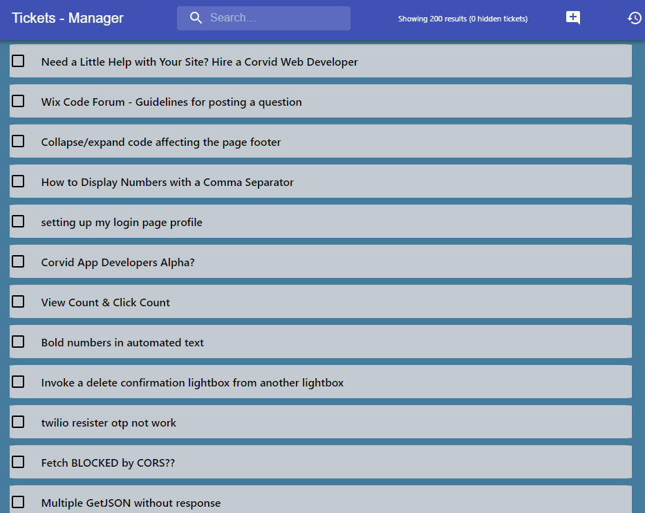
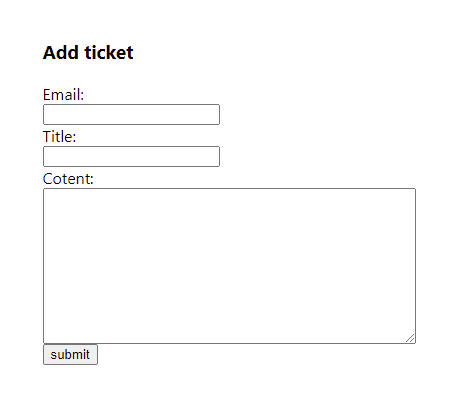

#    Zilbers - Tickets Manager
In this project I created a Ticket Manager Web Application, with React.js and Express.

## Running tests
* To run the *server tests* simply run `npm run test` on server folder
* To run the *client tests* make sure you started the development server on  port 3000 (via the `npm start` script) and then run `npm run test` from client folder

## Backend
- The Express app located in the path `server/app.js` and exports the `app` object (`module.exports = app;`).
- The server runs on port `8080` serve the react app on `http://localhost:8080/` and exposes those API endpoints:
  - [GET] api/tickets - returns an array of tickets from saved in `server/data.json`. If called with query param `searchText` the API will filter only tickets that have a title including a case-insensitive version of the `searchText` param
  - [POST] api/tickets/[:ticketId]/done - Sets `done` property to `true` for the given ticketId
  - [POST] api/tickets/[:ticketId]/undone - Sets `done` property to `false` for the given ticketId
  - [POST] api/tickets - Adds new ticket to data with unique ID and cration time
  - Added logger who makes all the work with the backend much easier

## Client
- The app title is `Tickets Manager` with a custom `favicon`.
- The app loads (from backend) and shows all Tickets.
- The app has input with id `searchInput`. This input requests the server on `onChange` with relevant `searchText` param and update the list accordingly.
- The app has button to restore the hidden ticket list on click with the id `restoreHideTickets`.
- Every ticket has hide button with className `hideTicketButton` that will hide the ticket from view. And there is counter with `hideTicketsCounter` className of number of hiding tickets.
- Every ticket has `markDone` button which marks that certain ticket as done and updates server
- The app has add ticket button which validates the input and sends it to the backend

## Deployment
- The app is deployed on glitch:

## Submitting
1. Before submitting, create a gif demoing your app in action using the testing framework by running the command: `$env:RECORD_TEST='true'; npm run test` in your client folder, this will create a gif file of your UI testing. Note, this may take up to 4min to complete
1. Open a PR from your work branch to the unchanged main branch (remember to include the generated `ui-testing-recording.gif` file)
1. Invite `Cyber4sPopo` as a [collaborator](https://docs.github.com/en/github/setting-up-and-managing-your-github-user-account/inviting-collaborators-to-a-personal-repository) to your repo 👮
1. Create a Pull Request from the new brunch into master in your duplicated repository
